# Smart Contract for Crop Insurance based on Blockchain

## Inspiration 
1) Natural disasters like floods and droughts frequently cause agricultural loss, which is a challenge for farmers. Farmers who are insured often have trouble getting the full value of their insurance from the insurance providers. Additionally, in this entire process, the insurance firms serve as a middleman. 
2) My idea for creating this Decentralized Platform came from the desire to cut out the middlemen and quickly resolve insurance claims made by the user.
### Below are
1. Traditional Network of farmer, Broker, Insurance provider and Bank which involves complex Documentation and takes time
2. Shared Ledger among farmer, Broker, Insurance provider and Bank on Blockchain Platform

  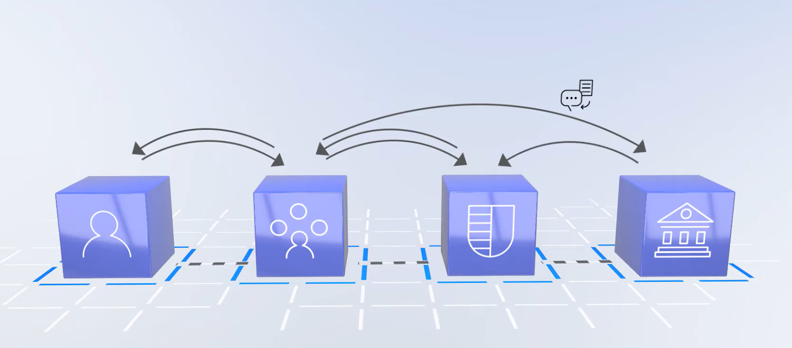
  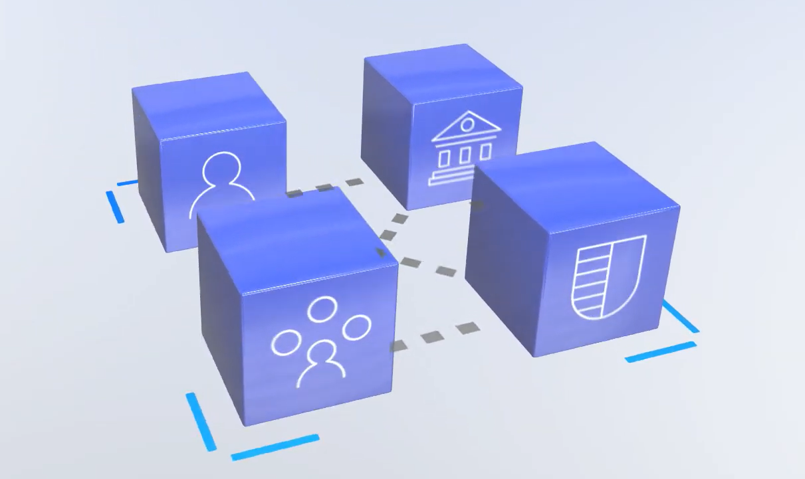

## Technology Stack Used
1. Solidity
2. Web3.js
3. Chainlink nodes as oracle
4. Matamask Account for blockchain transactions
5. [Weatherbit](https://www.weatherbit.io/api) and [Worldweatheronline APIs](https://www.worldweatheronline.com/weather-api/api/docs/)
6. [Remix IDE](https://remix-project.org/) for deployment on Ethereum Blockchain

## System Flowchart

  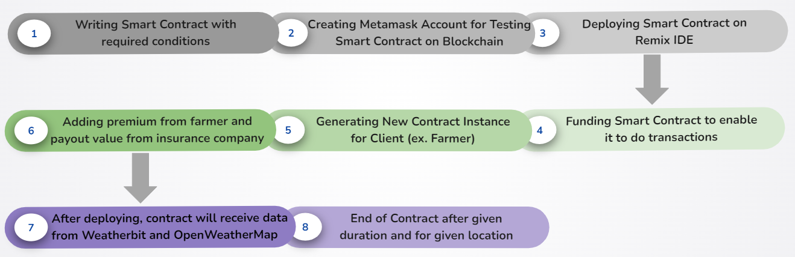

## Implementation Steps
Following are the steps to deploy our smart contract on remix IDE using our metamask account
1. After writing proper conditional code for smart contract we will deploy it by connecting our metamask account to smart contract using injected web3.js environment.

  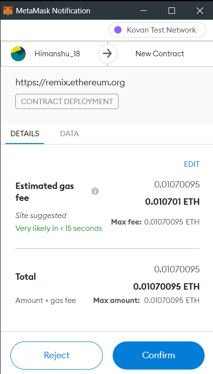
  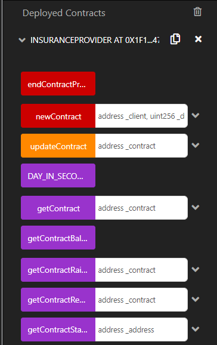

2. We have to fund the smart contract so that while creating instances for clients it should be able to fund the new_contract.
  

  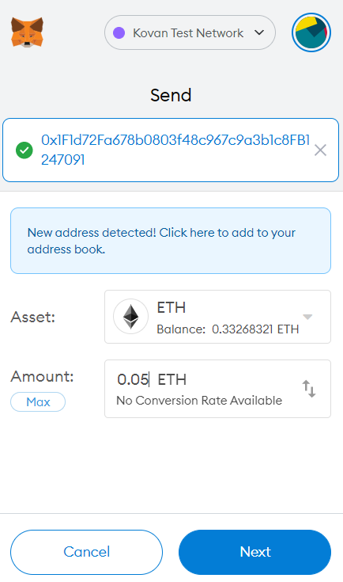
  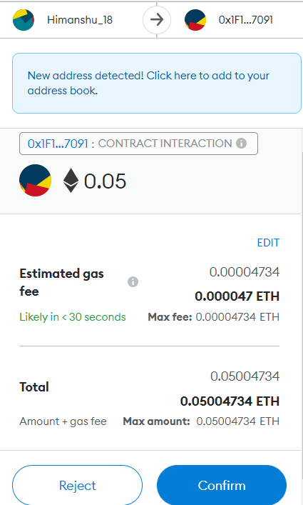

3. Now we have to create an instance of that smart contract for the client by filling in their blockchain ID, location, premium, payout value and duration for which contract will we live.
  

  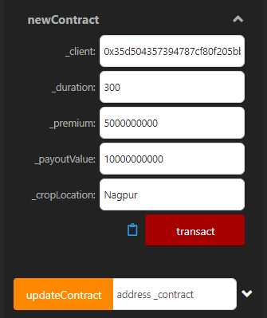

4. After transacting we can verify on Etherscan website that a new block has been created on ethereum blockchain (on kovan test network) for a client with some value in it.
  

  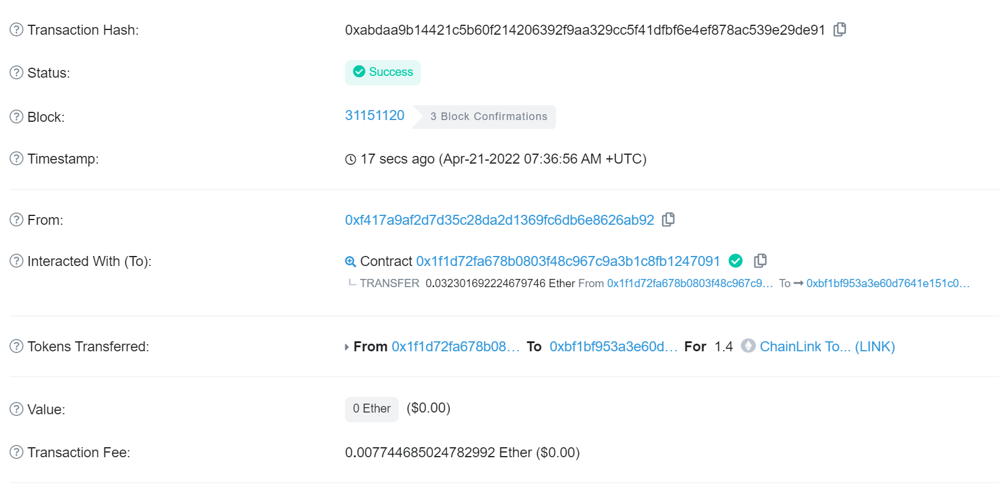

5. Now we can see that after the mentioned duration in the contract, the contract will end by transferring its amount to one of the parties (i.e. farmer or insurance company).
  

  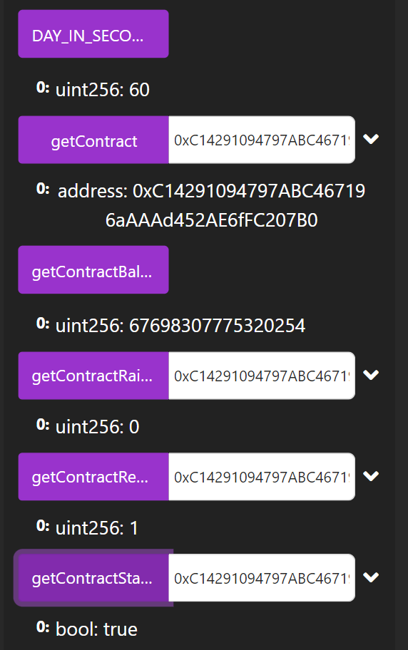
  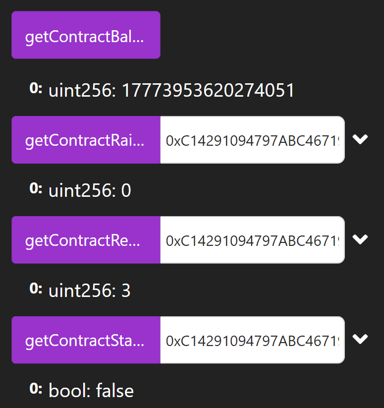

